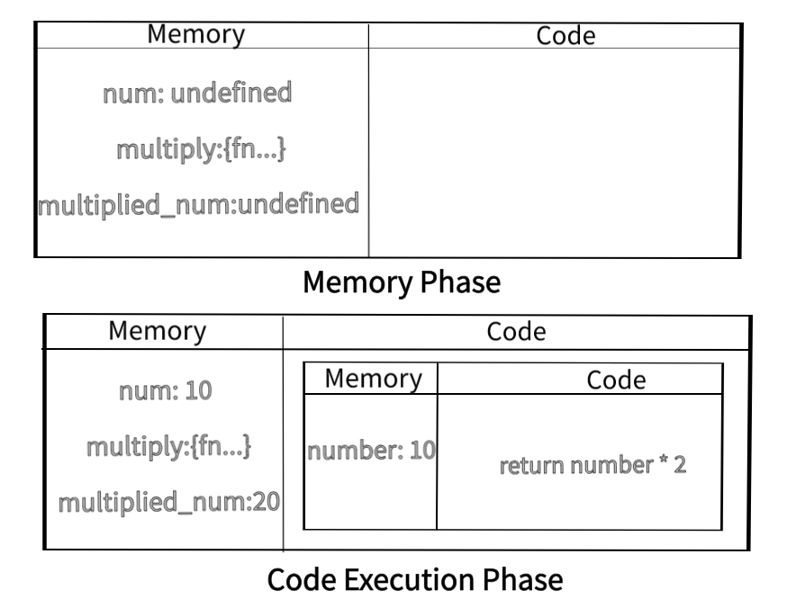

# javascript

## 1. Introduction

simply javascript refers to client side language that has it's own style of define and declaring the instruction to run a code and it has it's own way of functioning. it is synchronous single parse 2 phase loosly aka (weekly) type programming language mean we don't need to declare the type of the variable. it automatically treat them based on the value assigned to variable.

it's used to enhancing the interaction between client and the web page. JavaScript is a cross-platform so you don't need to worry to run js code on differ differ platform. javascript is flexible much that you can use it as a functional programming language or object oriented language.

it was developed by Brendan Eich in 1995 and that time javascript was interpreter language but nowadays with the modern JS Engine it is both interpreter and compiler language depend on the browser JS Engine to enhance the speed.

eg. -> v8 JS engine developed by google know as the fastest js engine. v8 use jit(Just in time) compiler to convert code into machine code for creating more optimized code that enhance the speed of execution.

## 2. Working

Execution Context/ variable environment/ Thread of execution ->

javascript has an environment called execution context in that our js code evaluate and executed. it is two phases.

1. Memory Creation Phase - in this phase memory allocation is done to each variables and function. labeling is done in this phase where undefined is assigned to all the variables and for the functions whole code is stored.
2. Code Execution Phase - in the execution phase variables assigned there actual value by executing that line in the code section and for every function a new execution context is created. where again all the process of two phase is done for variable and function that belongs from newly executed function. eg ->

```js
var num = 10;
function multiply(number) {
	return number * 2;
}
const multiplied_num = multiply(10);
```



javascript is single parse because of callback stack. it tracks the execution by performing the instruction from the top of stack and then remove it from stack and finally when stack get empty then global exection also got terminated. call stack has higher priority so event loop always check whether call stack is empty or not if it is empty and microtask task queue or callback queue want to execute they will execute otherwise they have to wait.

## 3. Hoisting

hoisting is the js behaviour that let us use to access variable and functions before declaring them.

```javascript
x = 10;
console.log(x); // 10
call_me(); // some one called me
function call_me() { 
	console.log('some one called me');
}
console.log(y); // undefined
var y = 10;
console.log(z); // reference error z is not defined.
z = 10;
console.log(un); // reference error un is not defined.
```

function is calling even before declaring but variable got console undefined that happens because of the memory phase where all variables assigned undefined and for the functions memory phase store it's code.

## 4. Functions

functions are the core part of the javascript. it is a set of statements binded all in a block that has their own execution context and has parameters as input and return the value based on input and the their statements.

function can be define in two ways ->

### 1. function declarations/statements ->

function declarations is consist of the name, parameters and the statement closed into the curly braces that define a function. eg ->

```javascript
function foo(parameter) {
	let a = parameter;
	return a * 2;
}
```

### 2. function expressions ->

functions can be assigned to a variable then used the variable instead of the function. in that case function could be anonymous(i.e. without name) function. eg ->

```javascript
const fun = function foo(parameter) {
	let a = parameter;
	return a * 2;
};
```

## 5. Window and Undefined

Window -> window is the global object that provides object, methods and properties that are useful and access by the user. setTimeOut, console all belongs to window and when we create variables in global execution context it is automatically assigned to window. another useful keyword is **this** that refers to the object from where it was called in global exection context **this** refers all the window's object.

```javascript
var a = 10;
console.log(a); // 10
console.log(window.a); // 10
console.log(this.a); // 10
```

Undefined -> undefined is the type and also assigned to the variables during memory phase. if variable is declared and not set to any value it automatically set by undefined.

```javascript
var a;
console.log(a);
```

## 6. Scope Chain

Lexical environment is created whenever execution context is created. a lexical environment is the local memory with thats parent lexical environment. so we can use the variable of the parent even it has been called. eg. ->

```javascript
function parent() {
	let value = 10;
	return function child() {
		console.log(value); // 10
	};
}
parent()(); //
```

in the above example parent is called and then in the parent the child is called and in the child it console the value of it's parent lexical environment. in lexical environment the statement is searched whether it exist or not in that scope otherwise it search it in it's parent and if statement is not present then it search in parent of parent if that parent is exist otherwise goes into global execution context. it is also know as Scope Chain.

## 7. Let Const

let and const also hoisted but they are in the temporal dead zone. let and the const stored in the seperated memory and for the access to let and the const you have to declare them otherwise reference error would occur.

let and const both are at the block scope so it cannot access outside their scop nor you can redeclare the same const and let varialble. const even not accept as the empty nor we can reassign it. let and const nor stored in the window object. they store the seperated memory.

### Temproral Dead Zone -> it is the time since let and const hoisted and till initialized the value.

```javascript
const b = 10;
b = 20; // Type error

const c; // syntax error

let temp = 10;
temp = 20;
console.log(temp); // 20

console.log(a); // reference error
let a = 10;
```

## 8. Block Scope

## 9. Closures

## 10. setTimeOut

## 11. Asynchronous JS

## 12. JS Engine
